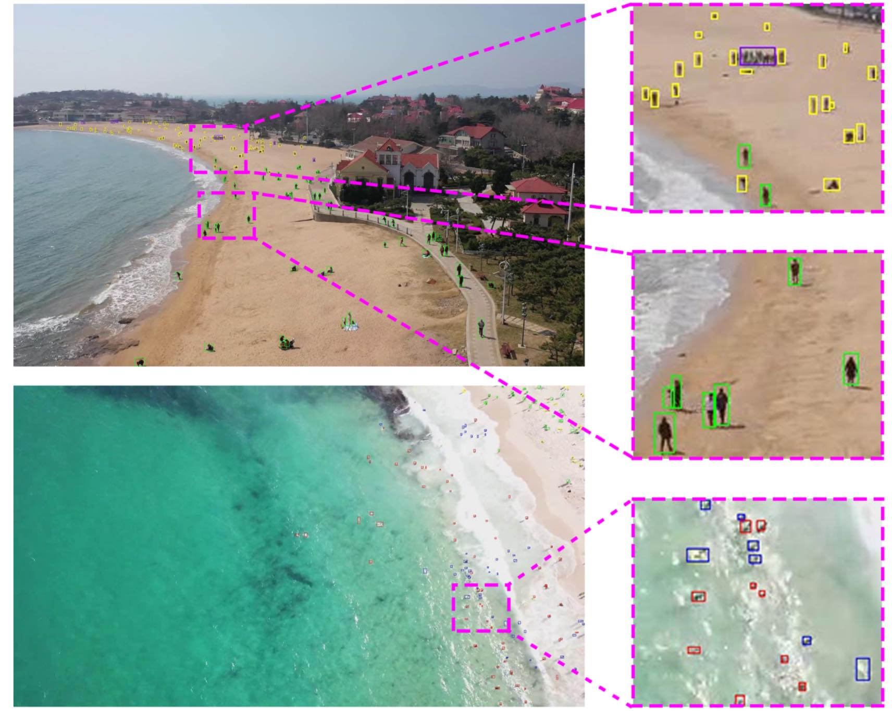
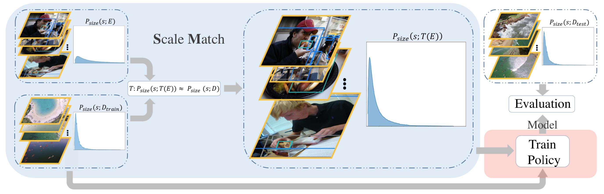

# Scale Match for Tiny Person Detection

------------------------
[[paper]](http://openaccess.thecvf.com/content_WACV_2020/papers/Yu_Scale_Match_for_Tiny_Person_Detection_WACV_2020_paper.pdf) [[ECCVW]](https://rlq-tod.github.io/index.html)

## TinyPerson Dataset

The dataset will be used to for ECCV2020 workshop [RLQ-TOD'20 @ ECCV](https://rlq-tod.github.io/index.html).

#### Download link:
[Official Site](http://vision.ucas.ac.cn/resource.asp): recomended, download may faster<br/>
[Baidu Pan](https://pan.baidu.com/s/1kkugS6y2vT4IrmEV_2wtmQ)   password: pmcq<br/>
[Google Driver](https://drive.google.com/open?id=1KrH9uEC9q4RdKJz-k34Q6v5hRewU5HOw)<br/>

For more details about TinyPerson dataset, please see [Dataset](dataset/)



## Tiny Benchmark
The benchmark is based on [maskrcnn_benchmark](https://github.com/facebookresearch/maskrcnn-benchmark) and [citypersons code](https://bitbucket.org/shanshanzhang/citypersons/src/default/evaluation/).

For more details about the benchmark, please see [Tiny Benchmark](tiny_benchmark/).

## Scale Match



## Citation

If you use the code and benchmark in your research, please cite:
```
@inproceedings{yu2020scale,
  title={Scale Match for Tiny Person Detection},
  author={Yu, Xuehui and Gong, Yuqi and Jiang, Nan and Ye, Qixiang and Han, Zhenjun},
  booktitle={The IEEE Winter Conference on Applications of Computer Vision},
  pages={1257--1265},
  year={2020}
}
```

