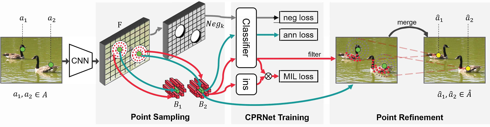
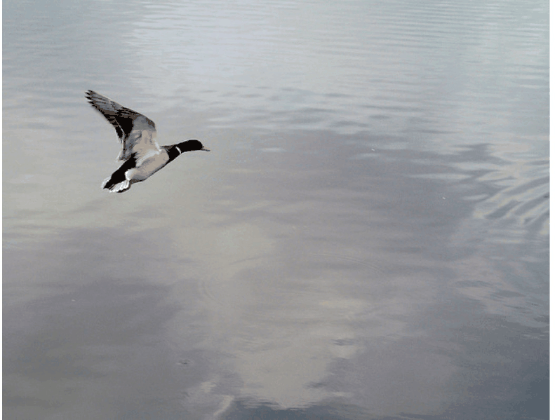

# Object Localization under Single Coarse Point Supervision (CVPR2022)

------

[[paper]]() [[poster]]()




## Prerequisites

### 1. install environment

As [Install](../../README.md) told.

### 2. dataset prepare

1. download COCO, DOTA and TinyPersonV2 as [dataset](../../../dataset/README.md) said
2. make soft-link to such directory
    ```
    cd PointTinyBenchmark/TOV_mmdetection
    mkdir data
    ln -s ${COCO} data/coco
    ln -s ${DOTA} data/dota
    ln -s ${TinyPersonV2} data/tiny_set_v2
    ```
3. generate or download coarse point annotation file

   a. COCO([Baidu Yun passwd:y71n](https://pan.baidu.com/s/1v9HIkfBChsUJRUGhisUrwA) or 
[Google Driver](https://drive.google.com/drive/folders/1QYEqwe3xNwJGsOEA72BPp8NAk1JdAtVT?usp=sharing)),
move CPR/data/coco/xxx_annotations to data/coco/xxx_annotations
   
   b. DOTA([Baidu Yun passwd:y71n](https://pan.baidu.com/s/1v9HIkfBChsUJRUGhisUrwA) or 
[Google Driver on the way ...](https://drive.google.com/drive/folders/1QYEqwe3xNwJGsOEA72BPp8NAk1JdAtVT?usp=sharing)),
unzip CPR/data/dota/DOTA-split/coarse_annotation.zip and move unziped directorys xxx to data/dota/DOTA-split/xxx
   
   c. TinyPerson V2(SeaPerson)([Baidu Yun passwd:y71n](https://pan.baidu.com/s/1v9HIkfBChsUJRUGhisUrwA) or 
[Google Driver on the way ...](https://drive.google.com/drive/folders/1QYEqwe3xNwJGsOEA72BPp8NAk1JdAtVT?usp=sharing)),
   unzip file in CPR/data/tiny_set_v2/anns/release/corner/coarse and move to data/tiny_set_v2/anns/release/corner/coarse

## Train


### 1. train on COCO
1. P2PNet
    ```shell script
    GPU=8 && LR=0.0001 && B=8 && PORT=10000 tools/dist_train.sh configs2/COCO/p2p/p2p_r50_fpn_1x_fl_sl1_coco400_coarse.py ${GPU} \
            --work-dir ../TOV_mmdetection_cache/work_dir/COCO/p2p/p2p_r50_fpn_1x_fl_sl1_coco400_coarse/adam${LR}_1x_${B}b${GPU}g${V}/ \
            --cfg-options optimizer.lr=${LR} data.samples_per_gpu=${B}
    ```

2. CPR + P2PNet
    ```shell script
    # [cmd 0] train CPRNet and inference on training set with CPRNet
    GPU=8 && CUDA_VISIBLE_DEVICES=0,1,2,3,4,5,6,7 PORT=10001 tools/dist_train.sh \
        configs2/COCO//coarsepointv2/coarse_point_refine_r50_fpn_1x_coco400.py 8 \
        --work-dir ../TOV_mmdetection_cache/work_dir/COCO//coarsepointv2/noise_rg-0-0-0.25-0.25_1/coarse_point_refine_r50_fpn_1x_coco400/loss0gt_r8_8_lr0.01_1x_8b8g/ \
        --cfg-options evaluation.save_result_file=../TOV_mmdetection_cache/work_dir/COCO//coarsepointv2/noise_rg-0-0-0.25-0.25_1/coarse_point_refine_r50_fpn_1x_coco400/loss0gt_r8_8_lr0.01_1x_8b8g//latest_result_refine4_r8_8.json
    
    # [cmd 1] turn result file to coco annotation fmt
    python exp/tools/result2ann.py --ori_ann data/coco/coarse_gen_annotations/noise_rg-0-0-0.25-0.25_1/pseuw16h16/instances_train2017_coarse.json \
        --det_file ../TOV_mmdetection_cache/work_dir/COCO//coarsepointv2/noise_rg-0-0-0.25-0.25_1/coarse_point_refine_r50_fpn_1x_coco400/loss0gt_r8_8_lr0.01_1x_8b8g//latest_result_refine4_r8_8.json \
        --save_ann ../TOV_mmdetection_cache/work_dir/COCO//coarsepointv2/noise_rg-0-0-0.25-0.25_1/coarse_point_refine_r50_fpn_1x_coco400/loss0gt_r8_8_lr0.01_1x_8b8g//instances_train2017_refine4_r8_8.json
    
    # [cmd 2] train P2PNet
    export GPU=8 && export LR=0.0001 && export BATCH=8 && CUDA_VISIBLE_DEVICES=0,1,2,3,4,5,6,7 PORT=10001 tools/dist_train.sh \
        configs2/COCO//p2p/p2p_r50_fpn_1x_fl_sl1_coco400_coarse.py 8 \
        --work-dir ../TOV_mmdetection_cache/work_dir/COCO//p2p_coarse/noise_rg-0-0-0.25-0.25_1//loss0gt_r8_8_lr0.01_1x_8b8g/_refine4_r8_8/p2p_r50_fpn_1x_fl_sl1_coco400_coarse/adam0.0001_1x_8b8g/ \
        --cfg-options optimizer.lr=${LR} data.samples_per_gpu=${B} \
            data.train.ann_file=../TOV_mmdetection_cache/work_dir/COCO//coarsepointv2/noise_rg-0-0-0.25-0.25_1/coarse_point_refine_r50_fpn_1x_coco400/loss0gt_r8_8_lr0.01_1x_8b8g//instances_train2017_refine4_r8_8.json
    ```
   
### 2. train on DOTA

1. P2PNet
    ```shell script
    export GPU=2 && export LR=0.0001 && export BATCH=4 && CUDA_VISIBLE_DEVICES=0,1 PORT=10001 tools/dist_train.sh \
      configs2/DOTA/p2p/p2p_r50_fpn_1x_fl_sl1_DOTA_coarse.py 2 \
      --work-dir ../TOV_mmdetection_cache/work_dir/DOTA//p2p/p2p_r50_fpn_1x_fl_sl1_DOTA/adam0.0001_1x_4b2g/  \
      --cfg-options optimizer.lr=0.0001 data.samples_per_gpu=4
    ```

2. CPR + P2PNet
    ```shell script
    # [cmd 0]
    GPU=2 && CUDA_VISIBLE_DEVICES=0,1 PORT=10001 tools/dist_train.sh \
      configs2/DOTA//coarsepointv2/coarse_point_refine_r50_fpns4_1x_DOTA_1024.py 2 \
      --work-dir ../TOV_mmdetection_cache/work_dir/DOTA//coarsepointv2/noise_rg-0-0-0.25-0.25_1/coarse_point_refine_r50_fpns4_1x_DOTA_1024/loss0gt_r7_7_lr0.0001_1x_1b4g_s8/ \
      --cfg-options optimizer.lr=0.0001 data.samples_per_gpu=1 \
        model.bbox_head.strides=[8] model.neck.start_level=1 \
        model.bbox_head.refine_pts_extractor.pos_generator.radius=7 \
        model.bbox_head.refine_pts_extractor.neg_generator.radius=7  \
        model.bbox_head.train_pts_extractor.pos_generator.radius=7 \
        model.bbox_head.train_pts_extractor.neg_generator.radius=7 \
        evaluation.save_result_file=../TOV_mmdetection_cache/work_dir/DOTA//coarsepointv2/noise_rg-0-0-0.25-0.25_1/coarse_point_refine_r50_fpns4_1x_DOTA_1024/loss0gt_r7_7_lr0.0001_1x_1b4g_s8//latest_result_refine2_2_r7_7.json 
    
    # [cmd 1]
    python exp/tools/result2ann.py --ori_ann data/dota/DOTA-split/trainsplit/noise_rg-0-0-0.25-0.25_1/pseuw16h16/DOTA_train_1024_coarse.json \
      --det_file ../TOV_mmdetection_cache/work_dir/DOTA//coarsepointv2/noise_rg-0-0-0.25-0.25_1/coarse_point_refine_r50_fpns4_1x_DOTA_1024/loss0gt_r7_7_lr0.0001_1x_1b4g_s8//latest_result_refine2_2_r7_7.json \
      --save_ann ../TOV_mmdetection_cache/work_dir/DOTA//coarsepointv2/noise_rg-0-0-0.25-0.25_1/coarse_point_refine_r50_fpns4_1x_DOTA_1024/loss0gt_r7_7_lr0.0001_1x_1b4g_s8//DOTA_train_1024_refine2_2_r7_7.json
    
    # [cmd 2]
    export GPU=2 && export LR=0.0001 && export BATCH=4 && CUDA_VISIBLE_DEVICES=0,1 PORT=10001 tools/dist_train.sh \
      configs2/DOTA//p2p/p2p_r50_fpn_1x_fl_sl1_DOTA_coarse.py 2 \
      --work-dir ../TOV_mmdetection_cache/work_dir/DOTA//p2p_coarse/noise_rg-0-0-0.25-0.25_1//loss0gt_r7_7_lr0.0001_1x_1b4g_s8/p2p_r50_fpn_1x_fl_sl1_DOTA/adam0.0001_1x_4b2g_refine2_2_r7_7/  \
      --cfg-options optimizer.lr=0.0001 data.samples_per_gpu=4 \
        data.train.ann_file=../TOV_mmdetection_cache/work_dir/DOTA//coarsepointv2/noise_rg-0-0-0.25-0.25_1/coarse_point_refine_r50_fpns4_1x_DOTA_1024/loss0gt_r7_7_lr0.0001_1x_1b4g_s8//DOTA_train_1024_refine2_2_r7_7.json
    ```

### 3. train on TinyPerson V2(SeaPerson)

1. P2PNet
   ```shell
   export GPU=4 && LR=1e-4 && B=2 && WH=(640 640) && CONFIG="TinyPersonV2/p2p/p2p_r50_fpns4_1x_fl_sl1_TinyPersonV2_640" && \
   CUDA_VISIBLE_DEVICES=0,1,2,3 PORT=10000 tools/dist_train.sh configs2/${CONFIG}.py $GPU \
   --work-dir ../TOV_mmdetection_cache/work_dir/${CONFIG}/trainval${WH[0]}x${WH[1]}_adamlr${LR}_1x_b${B}${GPU}g_coarse/ \
   --cfg-options optimizer.lr=${LR} data.samples_per_gpu=${B} \
    data.train.ann_file="data/tiny_set_v2/anns/release/corner/coarse/noise_rg-0-0.25_1/corner_w640_h640/pseuw16h16/rgb_train_w640h640ow100oh100_coarse.json" \
    data.val.ann_file="data/tiny_set_v2/anns/release/rgb_test.json"
   ```
   
2. CPR+P2PNet

```shell
# [cmd 0]
GPU=4 && CUDA_VISIBLE_DEVICES=0,1,2,3 PORT=10000 tools/dist_train.sh configs2/TinyPersonV2//coarsepointv2/coarse_point_refine_r50_fpns4_0.5x_TinyPersonV2_640.py ${GPU}\
 --work-dir ../TOV_mmdetection_cache/work_dir/TinyPersonV2//coarsepointv2/noise_rg-0-0.25_1/coarse_point_refine_r50_fpns4_0.5x_TinyPersonV2_640/loss0gt_r5_5_lr0.05_1x_2b4g/\
 --cfg-options optimizer.lr=0.05 \
  evaluation.save_result_file=../TOV_mmdetection_cache/work_dir/TinyPersonV2//coarsepointv2/noise_rg-0-0.25_1/coarse_point_refine_r50_fpns4_0.5x_TinyPersonV2_640/loss0gt_r5_5_lr0.05_1x_2b4g//latest_result_refine2_2_r5_5.json

# [cmd 1]
python exp/tools/result2ann.py --ori_ann data/tiny_set_v2/anns/release/corner/coarse/noise_rg-0-0.25_1/corner_w640_h640/pseuw16h16/rgb_train_w640h640ow100oh100_coarse.json \
  --det_file ../TOV_mmdetection_cache/work_dir/TinyPersonV2//coarsepointv2/noise_rg-0-0.25_1/coarse_point_refine_r50_fpns4_0.5x_TinyPersonV2_640/loss0gt_r5_5_lr0.05_1x_2b4g//latest_result_refine2_2_r5_5.json \
  --save_ann ../TOV_mmdetection_cache/work_dir/TinyPersonV2//coarsepointv2/noise_rg-0-0.25_1/coarse_point_refine_r50_fpns4_0.5x_TinyPersonV2_640/loss0gt_r5_5_lr0.05_1x_2b4g//rgb_train_w640h640ow100oh100_refine2_2_r5_5.json

# [cmd 2]
export GPU=4 && export LR=0.0001 && export BATCH=2 && export WH='(640 640)' && CUDA_VISIBLE_DEVICES=0,1,2,3 PORT=10000 tools/dist_train.sh \
 configs2/TinyPersonV2//p2p/p2p_r50_fpns4_0.5x_fl_sl1_TinyPersonV2_640.py 4 \
 --work-dir ../TOV_mmdetection_cache/work_dir/TinyPersonV2//p2p_coarse/noise_rg-0-0.25_1//loss0gt_r5_5_lr0.05_1x_2b4g/p2p_r50_fpns4_0.5x_fl_sl1_TinyPersonV2_640/adam0.0001_1x_2b4g/ \
 --cfg-options optimizer.lr=0.0001 data.samples_per_gpu=2 \
  data.train.ann_file=../TOV_mmdetection_cache/work_dir/TinyPersonV2//coarsepointv2/noise_rg-0-0.25_1/coarse_point_refine_r50_fpns4_0.5x_TinyPersonV2_640/loss0gt_r5_5_lr0.05_1x_2b4g//rgb_train_w640h640ow100oh100_refine2_2_r5_5.json\
  data.val.ann_file='data/tiny_set_v2/anns/release/rgb_test.json'
```

## Test && Visualization

1. train network to obtain weighted or download [our trained weight](COCO([Baidu Yun passwd:y71n](https://pan.baidu.com/s/1v9HIkfBChsUJRUGhisUrwA))
2. visualization of CPR (take COCO as example)
   ```
   python tools/train.py configs2/COCO/coarsepointv2/coarse_point_refine_r50_fpn_1x_coco400_dbg.py \
       --cfg-options \
           evaluation.do_first_eval=True \
           model.bbox_head.refine_pts_extractor.pos_generator.radius=8 \
           load_from="../TOV_mmdetection_cache/work_dir/CPR/weights/coco/cpr_epoch_12.pth" \
           model.bbox_head.debug_info.COUNT=10 model.bbox_head.debug_info.epoch=-1 \
           model.bbox_head.debug_info.COUNT=10 model.bbox_head.debug_info.show=True
   ```
3. visualization of P2PNet (take coco as example)
   ```
   python demo/p2p_image_demo.py data/coco/images/000000005754.jpg \
      configs2/COCO/p2p/p2p_r50_fpn_1x_fl_sl1_coco400_coarse.py \
      ../TOV_mmdetection_cache/work_dir/CPR/weights/coco/cpr_p2p_epoch_12.pth
   ```

## Gif example




