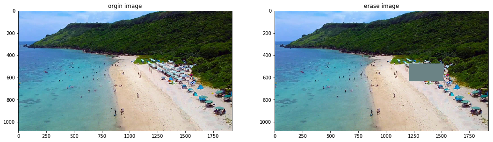
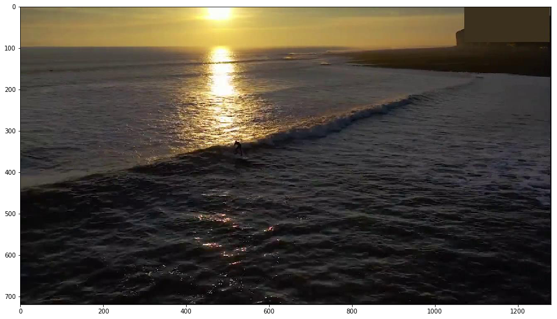
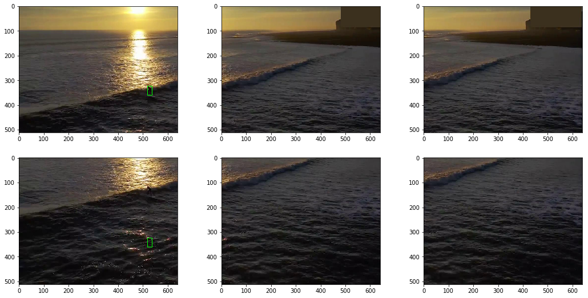
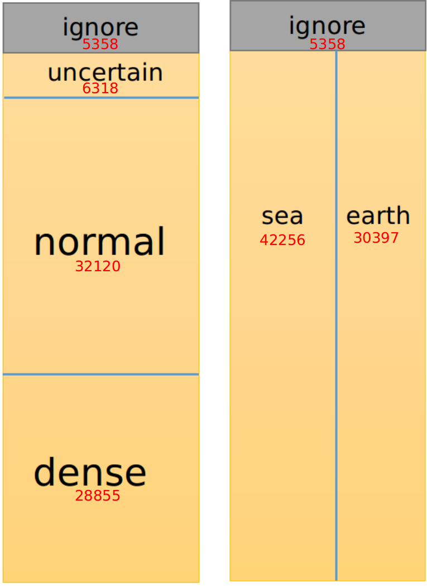

### [1. Annotation rules](#1.)
#### ["sea" and "earth"](#1.1)
#### ["ignore"](#1.2)
#### ["uncertain"](#1.3)
#### ["dense"](#1.4)
### [2. Json Annotation File Introduce and example](#2.)
#### [2.1 annotation format](#2.1)
#### [2.2 erase](#2.2)
#### [2.3 corner](#2.3)
#### [2.4 task](#2.4)
#### [2.5 dense](#2.5)
### [3. Dataset introduction](#3.)
#### [tiny person detection task](#3.1)

--------------------

Download link:<br/>
[Official Site](http://vision.ucas.ac.cn/resource.asp): recomended, download may faster<br/>
[Baidu Pan](https://pan.baidu.com/s/1kkugS6y2vT4IrmEV_2wtmQ)   password: pmcq<br/>
[Google Driver](https://drive.google.com/open?id=1KrH9uEC9q4RdKJz-k34Q6v5hRewU5HOw)<br/>

# 1. Annotation rules <a name="1."></a>
### "sea" and "earth" <a name="1.1"></a>
In TinyPerson, we classify persons as “sea person” (persons in the sea) or “earth person” (persons
on the land). We define four rules to determine the label of a person:
1) Persons on boat are treated as “sea person”;
2) Persons lying in the water are treated as “sea person”;
3) Persons with more than half body in water are treated as “sea person”;
4) others are treated as “earth person”.

### "ignore" <a name="1.2"></a>
In TinyPerson, there are three conditions where persons are labeled as “ignore”:
1. Crowds, which we can recognize as persons in group. However, persons in the crowds are hard to be separated one by one with standard rectangles;
2. Ambiguous regions, which are hard to clearly distinguish whether there is one or more persons;
3. Reflections in the water.

### "uncertain" <a name="1.3"></a>
In TinyPerson, some objects are hard to be recognized as human beings, we directly labeled them “uncertain”.

### "dense" <a name="1.4"></a>
In TinyPerson, image, which contains more than 220 annotations, is called "dense image", the annotation boxes in
such image are called "dense" boxes(annotation). "dense" boxes may have some inaccurate labels, which is a person or an "uncertain" region.

# 2. Json Annotation File Introduction and An Example <a name="2."></a>

## 2.1 annotation format <a name="2.1"></a>

The json annotation file just follows the format of coco annotation.

```py
train_anno = json.load(open('./tiny_set/annotations/tiny_set_train.json'))
```


```py
print(train_anno.keys())
```


```
dict_keys(['type', 'annotations', 'images', 'categories'])
```


```py
print(train_anno['images'][0])
```


```
{'file_name': 'labeled_images/bb_V0032_I0001640.jpg',
 'height': 720,
 'width': 1280,
 'id': 0}
```


```py
print(train_anno['annotations'][0])
```


```
{'segmentation': [[1081.124389319407,
   17.45930926910859,
   1267.431666947439,
   17.45930926910859,
   1267.431666947439,
   67.73270164492683,
   1081.124389319407,
   67.73270164492683]],
 'bbox': [1081.124389319407,
  17.45930926910859,
  186.3072776280319,
  50.27339237581825],
 'category_id': 1,
 'area': 9366.298870664552,
 'iscrowd': 0,
 'image_id': 0,
 'id': 0,
 'ignore': True,
 'uncertain': False,
 'logo': True,
 'in_dense_image': False}
```


```py
print(train_anno['categories'])
```


```
[{'id': 1, 'name': 'sea_person', 'supercategory': 'person'},
 {'id': 2, 'name': 'earth_person', 'supercategory': 'person'}]
```


```py
print(train_anno['type'])
```


```
instance
```


## 2.2 erase <a name="2.2"></a>

```py
train_anno = json.load(open('./tiny_set/annotations/tiny_set_train.json'))
erase_train_anno = json.load(open('./tiny_set/erase_with_uncertain_dataset/annotations/tiny_set_train.json'))

count_anno_f = lambda annos: len([anno for anno in annos if (anno['ignore']) or anno['uncertain'] or anno['logo']])
print('train anno:', count_anno_f(train_anno['annotations']))
print('erase train anno:', count_anno_f(erase_train_anno['annotations']))
```


```
train anno: 6855
erase train anno: 0
```


```py
from PIL import Image
import matplotlib.pyplot as plt
img = Image.open('tiny_set/train/' +  train_anno['images'][1]['file_name'])
erase_img = Image.open('tiny_set/erase_with_uncertain_dataset/train/' +  train_anno['images'][1]['file_name'])
plt.figure(figsize=(18, 9))
plt.subplot(1, 2, 1); plt.imshow(img); plt.title('orgin image')
plt.subplot(1, 2, 2);plt.imshow(erase_img); plt.title('erase image')
```




## 2.3 corner <a name="2.3"></a>

corner dataset is trying to cut images in dataset piece by piece. Different from generating sub-images, images is just cutted on annotation file by adding a keword 'cornor' and then shifting GT box in sub-images. For example, cutting an image into K pieces.

```
images: {'file_name': origin_img_name, 'id': origin_img_id, ...}
annotations: {'id': gt_id, 'image_id': origin_img_id, 'bbox': (gx1, gy1, gh1, gw1), ...}
```


=>

```
images:
    {'file_name': origin_img_name, 'corner': (x1, y1, w, h), 'id': new_img_id, ...}
    {'file_name': origin_img_name, 'corner': (x2, y2, w, h), 'id': new_img_id+1,...}
    ....
    {'file_name': origin_img_name, 'corner': (xk, yk, w, h), 'id': new_img_id+k-1,...}
annotations:
    {'id': new_gt_id, 'image_id': new_img_id+i, 'bbox': (gx1-xi, gy1-yi, gh1, gw1), ...} (this GT box is in i-th sub-image)
```


the k sub-images share the same 'file_name' with origin image, 'corner' represents the sub-region of the sub-image in the origin image.

```python
def img_id_to_annotations(coco_annos):
    img2annos = {}
    for anno in coco_annos['annotations']:
        if anno['image_id'] not in img2annos:
            img2annos[anno['image_id']] = [anno]
        else:
            img2annos[anno['image_id']].append(anno)
    return img2annos

def file_name_to_img_infos(corner_coco_anno):
    name2infos = {}
    for img_info in corner_coco_anno['images']:
        name = img_info['file_name']
        img_id = img_info['id']
        if name in name2infos:
            name2infos[name].append(img_info)
        else:
            name2infos[name] = [img_info]
    return name2infos

erase_image_dir = './tiny_set/erase_with_uncertain_dataset/'
tiny_erase_corner_task_dir = erase_image_dir + 'annotations/corner/task/'
corner_train_anno = json.load(open(tiny_erase_corner_task_dir + 'tiny_set_train_sw640_sh512_all.json'))

im2annos = img_id_to_annotations(corner_train_anno)
name2infos = file_name_to_img_infos(corner_train_anno)

from random import random
from PIL import Image
import matplotlib.pyplot as plt

plt.figure(figsize=(18, 9))
img_name = corner_train_anno['images'][0]['file_name']
img = Image.open(erase_image_dir + 'train/' +  img_name)
plt.imshow(img)
```




```py
img_infos = name2infos[img_name]
img_infos
```


```
[{'file_name': 'labeled_images/bb_V0032_I0001640.jpg',
  'height': 512,
  'width': 640,
  'id': 0,
  'corner': [0, 0, 640, 512]},
 {'file_name': 'labeled_images/bb_V0032_I0001640.jpg',
  'height': 512,
  'width': 640,
  'id': 1,
  'corner': [590, 0, 1230, 512]},
 {'file_name': 'labeled_images/bb_V0032_I0001640.jpg',
  'height': 512,
  'width': 640,
  'id': 2,
  'corner': [640, 0, 1280, 512]},
 {'file_name': 'labeled_images/bb_V0032_I0001640.jpg',
  'height': 512,
  'width': 640,
  'id': 3,
  'corner': [0, 208, 640, 720]},
 {'file_name': 'labeled_images/bb_V0032_I0001640.jpg',
  'height': 512,
  'width': 640,
  'id': 4,
  'corner': [590, 208, 1230, 720]},
 {'file_name': 'labeled_images/bb_V0032_I0001640.jpg',
  'height': 512,
  'width': 640,
  'id': 5,
  'corner': [640, 208, 1280, 720]}]
```


```py
plt.figure(figsize=(18, 9))
color = (0, 1, 0)
for i,  img_info in enumerate(img_infos):
    plt.subplot(2, 3, i+1)
    corner = img_info['corner']
    sub_img = img.crop(corner)
#     plt.gca().add_patch(plt.Rectangle((corner[0], corner[1]), corner[2], corner[3], fill=False, color=color, linewidth=2))
    plt.imshow(sub_img)
    if img_info['id'] in im2annos:
        for anno in im2annos[img_info['id']]:
            box = anno['bbox']
            plt.gca().add_patch(plt.Rectangle((corner[0]+box[0], corner[1]+box[1]), box[2], box[3], fill=False, color=color))
```




## 2.4 task <a name="2.4"></a>

'task' means making TinyPerson as a binary-classification task, where there are three kinds of taskes: 

task | note
---| ---
'sea'| only keeping annotations which category is sea_person, set other annotation as 'ignore'
'earth'| only keep annotations which category is earth_person, set other annotation as 'ignore'
'all'| set all annotations which categoriy is either sea_person or earth_person as 'person'

```py
erase_image_dir = './tiny_set/erase_with_uncertain_dataset/'
tiny_erase_corner_dir = erase_image_dir + 'annotations/corner/'
corner_train_all_anno = json.load(open(tiny_erase_corner_dir + 'task/tiny_set_train_sw640_sh512_all.json'))
corner_train_sea_anno = json.load(open(tiny_erase_corner_dir + 'task/tiny_set_train_sw640_sh512_sea.json'))
corner_train_earth_anno = json.load(open(tiny_erase_corner_dir + 'task/tiny_set_train_sw640_sh512_earth.json'))

corner_train_not_task_anno = json.load(open(tiny_erase_corner_dir + 'tiny_set_train_sw640_sh512.json'))

# categories, non-ignore annotations count, 
info_f = lambda anno: (anno['categories'], len([ann for ann in anno['annotations'] if not ann['ignore']]))
print(info_f(corner_train_all_anno))
print(info_f(corner_train_sea_anno))
print(info_f(corner_train_earth_anno))
print(info_f(corner_train_not_task_anno))
```


```
([{'id': 1, 'name': 'person', 'supercategory': 'none'}], 32430)
([{'id': 1, 'name': 'sea_person', 'supercategory': 'person'}], 11030)
([{'id': 2, 'name': 'earth_person', 'supercategory': 'person'}], 21400)
([{'id': 1, 'name': 'sea_person', 'supercategory': 'person'}, {'id': 2, 'name': 'earth_person', 'supercategory': 'person'}], 32430)
```


## 2.5 dense <a name="2.5"></a>

In TinyPerson, image, which contains more than 220 (DENSE_THRESHOLD) annotations, is called "dense image", the annotation boxes in
such image are called "dense" boxes(annotation). "dense" boxes may have some inaccurate labels, which is a person or an "uncertain" region.

```py
def img_id_to_annotations(coco_annos):
    img2annos = {}
    for anno in coco_annos['annotations']:
        if anno['image_id'] not in img2annos:
            img2annos[anno['image_id']] = [anno]
        else:
            img2annos[anno['image_id']].append(anno)
    return img2annos

erase_image_dir = './tiny_set/'
tiny_erase_dir = erase_image_dir + 'annotations/'
train_anno = json.load(open(tiny_erase_dir + 'tiny_set_train.json'))
train_with_dense_anno = json.load(open(tiny_erase_dir + 'tiny_set_train_with_dense.json'))

img_id2annos = img_id_to_annotations(train_anno)
with_dense_img_id2annos = img_id_to_annotations(train_with_dense_anno)

DENSE_THRESHOLD = 220

print('train origin image count:', len(train_anno['images']))
print('train orgin image + dense image count:', len(train_with_dense_anno['images']))
# images which have more than DENSE_THRESHOLD annotations are called dense image, tiny_set_train.json have excluded dense images.
print(len([len(annos) for img_id, annos in img_id2annos.items() if len(annos) > DENSE_THRESHOLD]))
print('dense image count:', len([len(annos) for img_id, annos in with_dense_img_id2annos.items() if len(annos) > DENSE_THRESHOLD]))
print('dense image count:', len(set(with_dense_img_id2annos.keys()) - set(img_id2annos.keys())))
```


```
train origin image count: 746
train orgin image + dense image count: 794
0
dense image count: 48
dense image count: 48
```


# 3. Dataset introduction <a name="3."></a>
There are 1610 labeled images and 759 non-labeled images (both are mainly from same video sets) and totally 72651 annotations in TinyPerson, shown as follows:

<center>

<div>Two ways for splitting annotations in TinyPerson</div>
</center>

 set |train| test | total | note
---| ---| --- | --- | ---
#(labeled image) | 794 |816 |1610
#annotations| 42197 |30454 |72651
| | |
\#(no dense image) | 717 | 781| 1498 | labeled image and #(annotated box) in \[1, 200\]
\#(dense image)     | 48  | 30 |   78 | labeled image and #(annotated box) > 200
\#(pure_bg_image)   | 29  | 5  |   34 | labeled image and #(annotated box) = 0
\#(no label image)  | 380 | 379|  759 | images not labeled but come from same video sets as others.
| | |
#normal | 18433 | 13787 | 32120 | box treated as person and not in *dense image*
#ignore | 3369  | 1989  | 5358  | see ignore rule in **Annotation rules**
#uncertain | 3486 | 2832 | 6318 | box cannot tell whether is a person(only labeled in *no dense image*)
#dense | 16909 | 11946 | 28855  | box treated as person adn in dense image
| | | 
#sea    | 26331 | 15925 |42256  | box(normal, uncertain or dense) in the sea
#earth  | 15867 | 14530 |30397  | box(normal, uncertain or dense) on the earth
#ignore | 3369  | 1989 |5358   | see ignore rule in **Annotation rules**


## tiny person detection task <a name="3.1"></a>
For tiny person detection task, the rules of evaluation on test set are given as follows:
1. we treat both "sea" and "earth" box as one class("person").
2. only "normal" box is treat as positive box.
3. "dense image"(which contains "dense" box) are not used while evaluation.
4. "ignore" box, same as pedestrian detection, is neither positive nor negative while evaluation, which means a detection result which matched "ignore" box will not be FP(false positive) or TP(true positive).
4. "uncertain" box are treated same as "ignore" box while evaluation.

In test set, there are 13787 positive annotations, 1989+2834 ignore ("uncertain" is treated same as "ignore") annotations. For training in the benchmark, we treat "normal" box as positive box, and erase 'ignore' and 'uncertain' region with mean value of the region in image, and dense images are not utilized for training.
