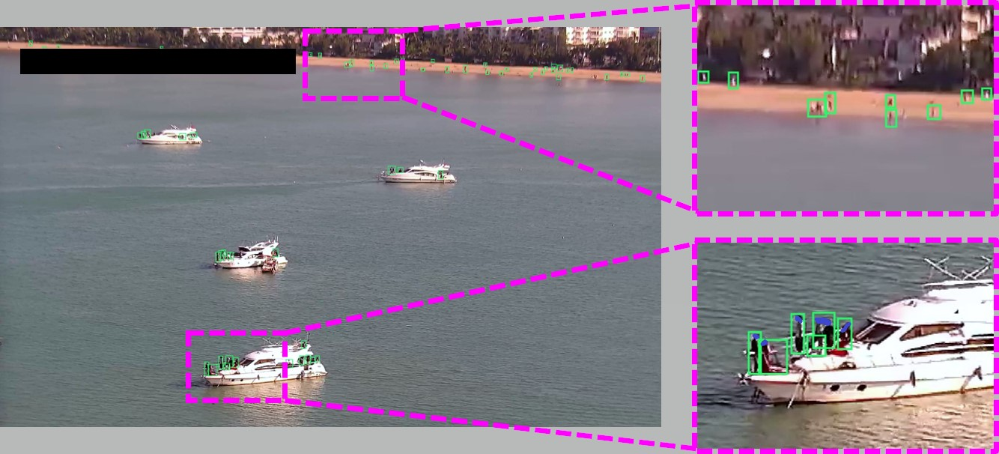

# Dataset

---------

## TinyPerson V2 (SeaPerson)
[Offical Site on the way ...](http://vision.ucas.ac.cn/sources) <br/>
[Baidu Pan](https://pan.baidu.com/s/1xaWLplWRT5dilwOPt8ljqg) password: ppsa<br/>
[Google Driver on the way...](https://drive.google.com/drive/folders/1K_vFUSxoiEjKXbjQ5LsxbUBRKb_vgXId?usp=sharing)

> Even most of the instances in our dataset are unidentifiable, and there can be no privacy issues.
But to deal with privacy issues thoroughly, We must highlight some control terms for the released dataset is released 
just like other released datasets with human faces:
```
1) Spreading image with clear person in TinyPerson V2 on the Socaial Internet is prohibited.
2) Images of identifiable people cannot be used to make demos and promotions without deidentifical.
3) The image in TinyPersonV2 can not be used for commercial/business purpose.

The downloaders may be held legally liable if violating the above items.  
```



## TinyPerson

The dataset will be used to for ECCV2020 workshop [RLQ-TOD'20 @ ECCV](https://rlq-tod.github.io/challenge1.html), [TOD challenge](https://competitions.codalab.org/competitions/24551)

#### Download link:
[Official Site](http://vision.ucas.ac.cn/sources) <br/>
[Baidu Pan](https://pan.baidu.com/s/1kkugS6y2vT4IrmEV_2wtmQ)   password: pmcq<br/>
[Google Driver](https://drive.google.com/open?id=1KrH9uEC9q4RdKJz-k34Q6v5hRewU5HOw) <br/>

For more details about TinyPerson dataset, please see [TinyPerson annotation](./TinyPerson_annotation.md).

For how to use the test_set annotation to evaluate, please see [Evaluation](https://github.com/ucas-vg/PointTinyBenchmark/blob/TinyBenchmark/tiny_benchmark/README.md#evaluation-)


## Tiny Citypersons
[Baidu Pan](https://pan.baidu.com/s/1CvEUuLKK6AFHpEZAjkS6fg) password：vwq2<br/>


## COCO
refer to their [official link](http://images.cocodataset.org)

http://images.cocodataset.org/zips/train2017.zip
http://images.cocodataset.org/zips/val2017.zip
http://images.cocodataset.org/annotations/annotations_trainval2017.zip
http://images.cocodataset.org/annotations/image_info_test2017.zip

## DOTA
refer to their [official link](https://captain-whu.github.io/DOTA/index.html)
